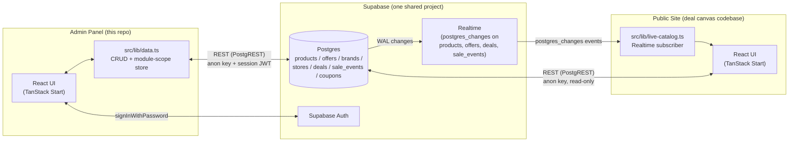
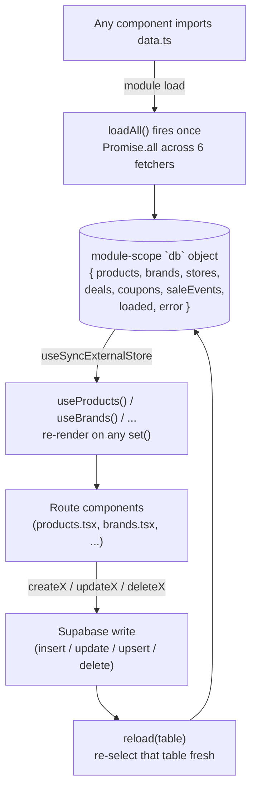

# Architecture — DealsCanvas Admin Panel

This document describes how the admin panel is put together technically:
system boundaries, data flow, and the design decisions behind the less
obvious parts. For the DB schema/RLS/pricing contract shared with the public
site, see [`shared-context.md`](shared-context.md) instead — this file is
about *this app's* internals.

## System overview

Two independent repos share one Supabase project. Neither can see the
other's code — `shared-context.md` is the only thing keeping them in sync.



Key point: **this app has no realtime subscription of its own.** It writes,
then re-fetches (`reload(table)`) — see "Data layer" below. Only the public
site listens for live Postgres changes, because it's the one that needs to
reflect an admin edit without a page reload for a shopper who's already on
the page.

## Stack

| Layer | Choice |
|---|---|
| Framework | TanStack Start (`@tanstack/react-start`), file-based routes under `src/routes/` |
| Build | Vite 8 → `nitro` server output |
| Styling | Tailwind v4, shared visual language with the public site (not shared code) |
| Backend | Supabase: Postgres + PostgREST (the de facto REST API) + Supabase Auth. No custom server routes, no Edge Functions |
| State | No React Query/SWR — a hand-rolled `useSyncExternalStore` module in `src/lib/data.ts` |

## Data layer (`src/lib/data.ts`)



- One store, six tables, loaded once at module import time (`void loadAll()` runs as a side effect of importing the file — not inside a component).
- Every mutation is **write, then re-fetch** — there's no optimistic update. Simpler to reason about; costs one extra round-trip before the UI reflects a change.
- `products` is fetched with a nested `select('*, offers(*)')` so every `ProductWithOffers` already carries its offers, no N+1 — but see the pagination note below.
- **PostgREST page-size cap**: an unbounded `select()` silently truncates at the project's configured max-rows (1000 here) instead of erroring. With 1300+ products, `fetchProducts()` paginates via `.range()` in batches of 1000 — this was a real, silent bug before it was found (roughly a third of the catalog was invisible to the dashboard).

## Derived data — nothing here is stored, all computed on read

Several fields shown in the UI don't exist as columns; they're computed from
what does:

| Shown as | Computed from | Function |
|---|---|---|
| Product status (Active/Low Stock/Out of Stock) | `offers[].availability` | `productStatus()` |
| Store status | Whether any of its products has an in-stock offer | `storeStatus()` |
| Sale event status (Active/Expired) | `window` category elapsed since `updated_at` (heuristic — no stored expiry date exists) | `saleEventStatus()` |
| "Last updated" (products/brands/stores/deals/sales) | `updated_at`, refreshed via `timeAgo()` | `productLastUpdated()`, `timeAgo()` |
| Deal status | Stored directly (`deals.status` column) — the one real, non-derived status field | — |

`updated_at` exists as a real `timestamptz` column on every table, but there
is **no database trigger** that bumps it on `UPDATE` — so every `create*`/
`update*` function in `data.ts` sets it explicitly in its own write payload.
Before this was fixed, the UI's "freshness" indicator read a manually-typed,
never-changing number (`offers.updated_hours_ago`) instead, which is why it
always looked frozen. `updated_hours_ago` itself is left untouched by this
app's admin UI even though it's no longer read here — it's a **site-facing**
field the public site's own freshness label still consumes; changing what's
written to it would be a cross-repo behavior change with no admin-panel
reason to make it.

`useLiveNow()` (`src/lib/time.ts`) is a `setInterval`-backed hook that ticks
every 30s purely to force a re-render, so `timeAgo()` labels visibly count
up while a tab is open rather than freezing at whatever they said on load.

## Write reliability: the silent-failure gap

Postgres RLS behaves differently for blocked `INSERT` vs blocked `UPDATE`:

- A blocked `INSERT` raises an explicit `new row violates row-level security
  policy` error (Postgres code `42501`).
- A blocked `UPDATE` **does not error** — the `USING` clause simply makes the
  row invisible to the statement, so it matches zero rows and returns
  success with an empty result. Confirmed empirically against the live
  project: an anon-key update that should have been rejected returned
  `error: null` with the row completely unchanged.

This means every `update*` function in `data.ts` requests the updated row
back (`.select()`) and throws if it comes back empty:

```ts
const { data, error } = await supabase.from('brands').update({...}).eq('slug', slug).select('slug')
if (error) throw error
assertRowsUpdated(data, 'Brand')   // throws if data.length === 0
```

Without this, an expired session or a tightened RLS policy would make the UI
show "saved" for an edit that silently did nothing.

## RLS / write permissions (current empirically-verified state)

See `shared-context.md` for the authoritative, cross-repo-agreed snapshot.
As last verified directly against the live project:

- `UPDATE`/`DELETE`: open to the `anon` key on all 7 tables.
- `INSERT`: blocked for `anon` on `products`/`brands`/`stores`; open on
  `offers`/`deals`/`sale_events`. A logged-in (`authenticated`) session has
  full insert/update/delete via the `to authenticated` policies in
  `src/scripts/rls-policies.sql` / `restore-products-rls.sql`.
- Practical effect: creating a product/brand/store from this dashboard
  requires an active login; editing an existing one currently doesn't
  (though it's not something to rely on — RLS here has drifted more than
  once, see `shared-context.md`'s History section).

## Realtime — not in this app, by design (with one caveat)

This app does not subscribe to `postgres_changes`. It doesn't need to: every
write already updates its own local store via `reload()`. The one scenario
this doesn't cover is a *second browser tab/session* editing the same data —
if that ever becomes a real workflow, that's where a realtime subscription
would need to be added here (see `shared-context.md`'s Realtime section for
how the public site does it, since the mechanism would be the same).

## UI structure

```
src/routes/
  login.tsx           Supabase Auth login
  admin/route.tsx      layout: sidebar nav (desktop) / slide-in drawer (mobile),
                        auth guard, breadcrumbs
  admin/index.tsx      dashboard home
  admin/products.tsx   search + category/brand filter pills + sort, status,
                        live "last updated", CSV import/bulk-update entry point
  admin/brands.tsx     CRUD + "last updated"
  admin/stores.tsx     CRUD + derived status + "last updated"
  admin/deals.tsx      CRUD + stored status + "last updated"
  admin/sales.tsx      CRUD (card grid, not a table) + derived status + "last updated"
  admin/analytics.tsx  read-only rollups
  admin/networks.tsx   read-only per-affiliate-network rollup
```

Shared building blocks in `src/components/admin/`: `Modal`, `ConfirmDialog`,
`FormField` (also exports `inputClass`/`selectClass`/`errorMessage`/
`runAction`), `StatusBadge` (Active/Low Stock/Out of Stock/Expired/Paused/
Upcoming — color-coded), and one `*Form.tsx` per entity.

## CSV import / bulk update (`ImportFeedModal.tsx` + `bulkImportProducts`)

- Custom RFC4180 CSV parser (handles quoted fields with embedded commas and
  newlines) — real product-feed data needs this, not a naive `split(',')`.
- Products are upserted on `slug` (auto-derived from `product_url`), not
  plain-inserted — re-importing a CSV containing a product you already
  imported updates it in place instead of hitting a duplicate-key error and
  aborting the batch. Offers have no natural unique key, so a re-imported
  product's offers are deleted and reinserted fresh rather than merged.
- The optional `images` column is one-URL-per-line within the cell (quoted),
  not comma- or semicolon-separated — image CDN URLs (Nike/Adidas, etc.)
  embed their own commas in transform parameters
  (`.../f_auto,c_scale,w_1.0,.../shoe.png`), so any single-character
  delimiter risks shredding a real URL. This exact bug hit production data
  once (four products had garbled `images` arrays) before being fixed.

## Known limitations / deliberate gaps

- No optimistic UI updates anywhere — every save is write-then-refetch.
- No realtime subscription in this app (see above).
- Sale event "Active/Expired" status is a heuristic (`window` category +
  elapsed time since `updated_at`), not backed by a real expiry timestamp
  column — there isn't one in the schema.
- Coupons have read access (`useCoupons()`) but no CRUD functions and no
  dedicated tab — only referenced from `analytics.tsx`.
- RLS write permissions have drifted more than once during this project's
  life (see `shared-context.md` History) — don't assume today's snapshot
  above is permanent; verify empirically before depending on it for
  anything security-sensitive.
